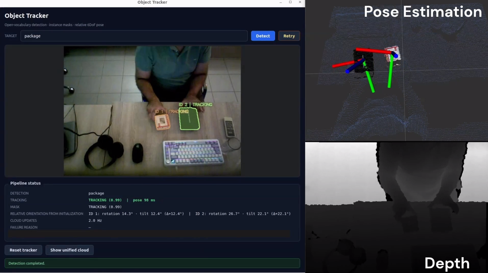

# Language-Guided Multi-Object Pose Tracking

This ROS 2 Humble workspace detects all instances of a text query, propagates
their masks with SAM2, estimates relative 6-DoF orientation with BundleTrack,
and publishes colored object clouds and pose markers for RViz.

The release contains only the Xtion + BundleSDF path:

- ASUS Xtion RGB and registered depth
- GroundingDINO open-vocabulary detection
- SAM2.1 video-memory instance tracking
- BundleTrack pose estimation for every active instance
- SAM-mask/Xtion-depth translation
- stable table frame, RViz markers, and Qt operator GUI

**IMPORTANT**: If you want to use the package with a different RGB-D camera than Xtion,
change the image topics accordingly

> **License note:** the original ROS integration is Apache-2.0, but the
> vendored BundleSDF component is restricted to non-commercial research or
> evaluation. Read [Third-party notices](THIRD_PARTY_NOTICES.md) before use or
> redistribution.



## Hardware and host requirements

- Ubuntu host with an NVIDIA GPU and recent NVIDIA driver
- NVIDIA Container Toolkit (`docker run --gpus all` must work)
- Docker with BuildKit
- ASUS Xtion / PrimeSense-compatible OpenNI2 camera
- X11 desktop session for the GUI and RViz
- approximately 16 GB of GPU memory for the complete pipeline **tested with Nvidia RTX 4060 16 GB**

The image includes ROS 2 Humble, OpenNI2, RViz, Qt, CUDA Python dependencies,
GroundingDINO, SAM2, BundleSDF, model checkpoints, and the compiled ROS
workspace. A host ROS installation or Python virtual environment is not used.

## Build the image

From the workspace root:

```bash
chmod +x docker/*.sh
./docker/build.sh
```

The first build is large and slow because OpenCV, PCL, BundleTrack, and CUDA
extensions are compiled. The default image name is `object-tracker:latest`.
Override it with `OBJECT_TRACKER_IMAGE` if required.

## Start the container

Allow local Docker clients to use the X server, then start the persistent
container:

```bash
xhost +local:docker
./docker/run.sh
```

The run script enables the GPU, host DDS networking, X11, and USB access. It
mounts only `./data` at `/data`; all code and dependencies are inside the image.

Open a shell for each process with:

```bash
docker exec -it object-tracker bash
```

Every interactive Bash shell automatically sources ROS Humble and the built
workspace at `/workspace/install`. `/opt/object_tracker` is a compatibility
link to the same install tree.

## Run the system

Use three container terminals in this order.

Terminal 1 — Xtion driver and RGB-D adapter:

```bash
ros2 launch object_tracker_bringup xtion_rgbd.launch.py
```

Terminal 2 — BundleTrack pose process:

```bash
ros2 run object_tracker_tracking bundlesdf_tracking_node --ros-args \
  --params-file /opt/object_tracker/share/object_tracker_bringup/config/params.yaml
```

Terminal 3 — GUI, GroundingDINO, SAM2, supervisor, table frame, and
visualization:

```bash
ros2 launch object_tracker_bringup xtion_bundle_pipeline.launch.py
```

Optional Terminal 4 — RViz demo view:

```bash
rviz2 -d /opt/object_tracker/share/object_tracker_bringup/rviz/object_tracker_camera_view.rviz
```

Enter a category such as `package`, `cup`, or `bottle` in the GUI and press
**Detect**. GroundingDINO runs once, SAM2 assigns persistent instance IDs, and
BundleTrack starts one pose context per active instance.

## Outputs

| Topic | Content |
|---|---|
| `/rgbd/rgb` | synchronized RGB image |
| `/rgbd/depth_m` | registered `32FC1` depth in metres |
| `/objects/masks` | per-instance SAM2 masks |
| `/objects/tracker_status` | raw BundleTrack instance poses |
| `/objects/table_poses` | object poses expressed in `table_frame` |
| `/object/unified_cloud` | muted Xtion scene plus RGB-colored object clouds |
| `/object/viz/markers` | labeled XYZ pose markers |
| `/object/viz/image` | GUI camera view with instance masks |

The object orientation is relative to its initialization pose. It is not a
semantic object coordinate system, and rotationally symmetric objects can have
an unobservable axis.

## Configuration

Runtime parameters are in
[`src/object_tracker_bringup/config/params.yaml`](src/object_tracker_bringup/config/params.yaml).
The most useful tuning parameters are:

- `grounding_node.initial_query`, `box_threshold`, `max_instances`
- `segmentation_node.propagation_rate_hz` and confidence thresholds
- `bundlesdf_tracking_node.feature_correspondence_resize`
- `bundlesdf_tracking_node.bundle_window_size`
- `bundlesdf_tracking_node.object_cloud_pixel_stride`
- `bundlesdf_tracking_node.nearby_cloud_pixel_stride`
- table-plane RANSAC thresholds under `table_frame_node`

To use another parameter file:

```bash
ros2 launch object_tracker_bringup xtion_bundle_pipeline.launch.py \
  params_file:=/data/my_params.yaml
```

Pass the same file to `bundlesdf_tracking_node`.

## Stop

```bash
./docker/stop.sh
xhost -local:docker
```

BundleSDF is included under `third_party/BundleSDF` and retains its upstream
license in `third_party/BundleSDF/LICENSE.txt`. The vendored BundleSDF base is
derived from upstream commit `ffa67d425240b5b76d2e387a7dd3d3735a7cf1a1`;
the image pins SAM2 to commit
`2b90b9f5ceec907a1c18123530e92e794ad901a4`.

## License and attribution

Original ROS integration code is licensed under [Apache-2.0](LICENSE).
Third-party components remain under their own terms; see
[THIRD_PARTY_NOTICES.md](THIRD_PARTY_NOTICES.md). Academic references are
collected in [CITATIONS.md](CITATIONS.md).
